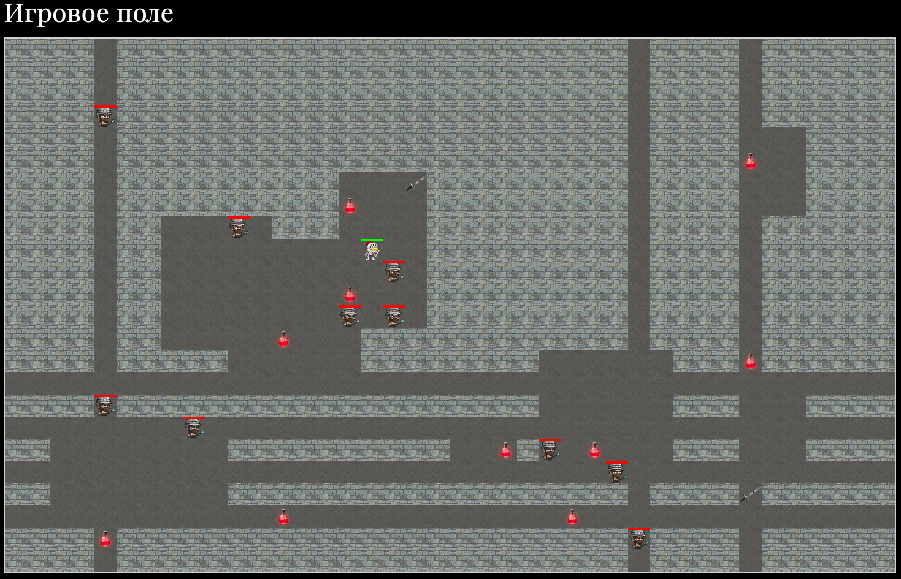

# Игра "Rogue" на JavaScript

## Особенности

-   Написана на ES5
-   Состояние хранится с помощью JavaScript, а не в DOM
-   Исключены недостижимые зоны
-   Герой передвигается клавишами `W`, `A`, `S`, `D` и бьет противников клавишей `Space` (каждое нажатие любой из этих клавиш является одним ходом)
-   Клавишей `Space` герой бьет всех соседних противников (включая по диагонали)
-   Противники передвигаются в случайную сторону (вертикально или горизонтально) на одну клетку на каждом ходу
-   Соседние к герою противники наносят ему урон
-   При столкновении с героем противники стоят на месте и наносят урон герою пока он не уйдет в сторону
-   При смерти героя игра останавливается (требуется перезагрузка страницы для игры заново)
-   При наступлении на зелья здоровья частично восстанавливается здоровье, а мечи увеличивают силу удара

